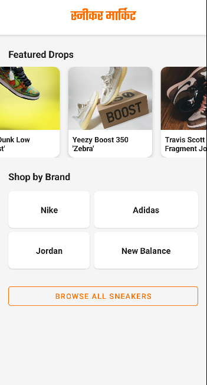
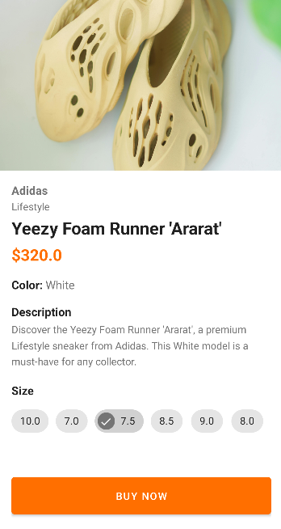
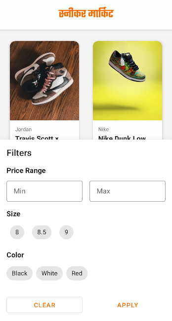
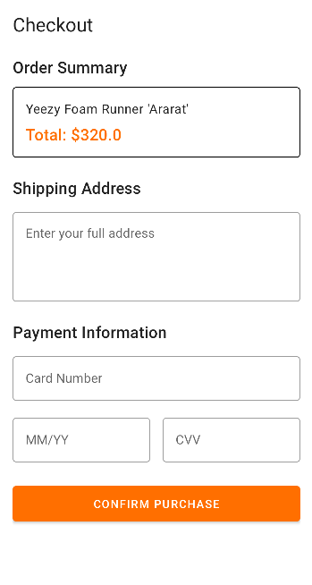

# SneakerMarket

SneakerMarket is a modern Android application designed for sneaker enthusiasts to browse, discover, and purchase the latest footwear. Built with a focus on user experience and clean design, the app offers a seamless flow from discovery to checkout.

## Features

- **Splash Screen:** Engaging entry point with custom animations.
- **User Authentication:** Simple login flow to access the marketplace.
- **Featured Drops:** Stay updated with the latest and most popular sneaker releases.
- **Shop by Brand:** Easily filter sneakers by your favorite brands like Nike, Adidas, Jordan, and New Balance.
- **Product Details:** View detailed information, high-quality images, and available sizes for each sneaker.
- **Seamless Checkout:** A streamlined order summary and payment information flow for quick purchases.

## Tech Stack

- **Language:** Kotlin
- **Architecture:** View-based (Activities & XML Layouts)
- **UI Components:** Material Design 3
- **Image Loading:** Glide
- **Navigation:** Intent-based activity transitions
- **Data Handling:** ViewBinding & DataBinding

## Getting Started

1. Clone the repository:
   ```bash
   git clone https://github.com/BnoGaming/SneakerMarket.git
   ```
2. Open the project in Android Studio.
3. Sync the project with Gradle files.
4. Run the app on an emulator or physical device.

## Screenshots

<p align="center">
  
  
  
</p>
<p align="center">
  
  
</p>
